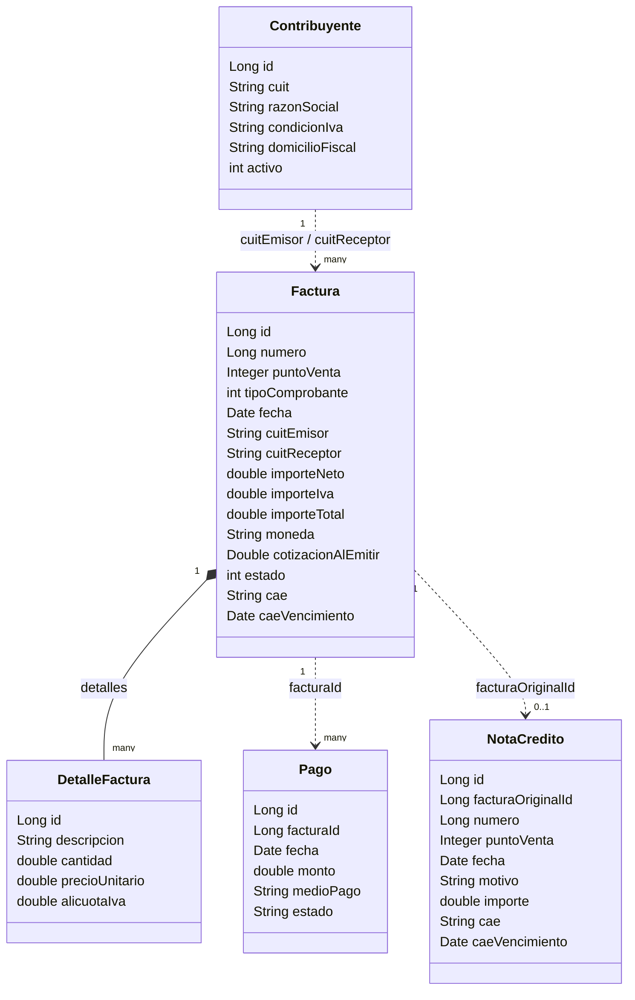

# Arquita Legacy - Monolito de Facturación (proyecto base del curso)

Este proyecto consiste en un monolito de facturación electrónica con temática del organismo
fiscal **Arquita**, construido con Java 7, Spring 3.x y configurado a mano con XML.

## Dominio

El sistema emite comprobantes (facturas y notas de crédito) entre
contribuyentes, y registra los pagos que se hacen contra esas facturas.

- **Contribuyente**: una persona o empresa identificada por su CUIT, con
  una condición frente al IVA (`RESPONSABLE_INSCRIPTO`, `MONOTRIBUTO`,
  `CONSUMIDOR_FINAL`, ...). Puede actuar como emisor o como receptor de
  una factura.
- **Factura**: un comprobante (tipo A, B o C) emitido por un contribuyente
  a otro, compuesto por una o más líneas (`DetalleFactura`). Tiene un
  importe neto, el IVA calculado, un total, y queda "autorizada" con un
  CAE y su fecha de vencimiento. Puede estar en distintos estados
  (borrador, emitida, pagada, anulada).
- **DetalleFactura**: cada línea de una factura: una descripción,
  cantidad, precio unitario y alícuota de IVA.
- **Pago**: un pago registrado contra una factura. Una factura puede
  recibir más de un pago hasta cubrir su importe total.
- **NotaCredito**: el comprobante que se emite cuando hay que anular una
  factura que ya fue pagada (en vez de anularla directamente).



Las flechas punteadas (`..>`) marcan relaciones que **no** son claves
foráneas ni asociaciones JPA reales: hoy son simples campos `String`/`Long`
sueltos (`cuitEmisor`, `cuitReceptor`, `facturaId`, `facturaOriginalId`)
que cada capa interpreta por su cuenta.

## Requisito: un JDK 7 u 8 configurado

Este proyecto compila con `maven.compiler.source/target = 1.7`, por lo que requiere la instalación de un JDK 8.

**Instalación en Windows** (PowerShell, con `winget` — ya incluido en
Windows 10/11):

```powershell
winget install --id EclipseAdoptium.Temurin.8.JDK --silent --accept-package-agreements --accept-source-agreements
```

Esto instala Eclipse Temurin JDK 8 en
`C:\Program Files\Eclipse Adoptium\jdk-8.0.x.x-hotspot` (la versión exacta
puede variar). En Mac/Linux, usar `sdkman` (`sdk install java 8.0.462-tem`)
o `jenv` en su lugar.

## Configurar el proyecto en IntelliJ IDEA

1. **Agregar el JDK 8 a IntelliJ** (si aún no está registrado):
   `File | Project Structure | Platform Settings | SDKs | +` y apuntarlo a
   la carpeta donde se realizó la instalación del JDK 8.
2. **Asignarlo al proyecto**: `File | Project Structure | Project | SDK`,
   elegir el JDK 8. En `Language Level` dejar `8` (o `7` si el IDE lo
   ofrece).
3. **Asignarlo también a Maven** (importante para que IntelliJ no utilice el JDK
   con el que corre el propio IDE para invocar `javac`): `Settings |
   Build, Execution, Deployment | Build Tools | Maven | Importing`, campo `JDK for
   importer`, elegir el JDK 8. Repetir en `Settings | Build Tools | Maven | Runner`, campo `JRE`.
5. **Levantar el proyecto**: abrir el panel Maven (`View | Tool Windows |
   Maven`), expandir `legacy-monolith-facturacion | Plugins | tomcat7`, y
   hacer doble click en `tomcat7:run` (o crear una Run Configuration de
   tipo Maven con el goal `tomcat7:run`).
6. Probar: `http://localhost:8080/arquita-legacy`.

Para utilizar desde la terminal, se requiere que `mvn` corra con el
JDK 8, no con el que esté primero en el `PATH` del sistema. En PowerShell,
apuntar `JAVA_HOME` al JDK 8 antes de invocar Maven (este cambio solo se
aplica a esa ventana de powershell):

```powershell
$env:JAVA_HOME = "C:\Program Files\Eclipse Adoptium\jdk-8.0.504.1-hotspot"
$env:Path = "$env:JAVA_HOME\bin;" + $env:Path
cd "legacy-monolith"
mvn -v   # confirmar que dice "Java version: 1.8...."
mvn tomcat7:run
```

No se requiere Oracle ni ninguna base externa para esto: por defecto el
proyecto usa **H2 en memoria** (en modo de compatibilidad Oracle). La base
es en memoria, por lo que cada `tomcat7:run` arranca desde cero.

## Probar la API

Entrar a `http://localhost:8080/arquita-legacy` esperando un **404** como respuesta
del servidor,

Al arrancar se cargan automáticamente 4 contribuyentes de prueba con CUIT
válido (ver `DataSeeder`). Se pueden probar los siguientes endpoints de tipo
GET para validar que la aplicación haya arrancado correctamente:

- `http://localhost:8080/arquita-legacy/api/contribuyentes/buscar?cuit=20-12345678-6`
- `http://localhost:8080/arquita-legacy/api/facturas/por-receptor?cuit=20-12345678-6`

El resto son POST, hace falta `curl` (o Postman/Insomnia):

```bash
# Crear una factura en pesos
curl -X POST "http://localhost:8080/arquita-legacy/api/facturas/crear" \
  --data-urlencode "cuitEmisor=30-71659554-0" \
  --data-urlencode "cuitReceptor=20-12345678-6" \
  --data-urlencode "tipoComprobante=6" \
  --data-urlencode "descripcionItem=Servicio de consultoria" \
  --data-urlencode "cantidad=1" \
  --data-urlencode "precioUnitario=10000"

# Crear una factura en USD
curl -X POST "http://localhost:8080/arquita-legacy/api/facturas/crear" \
  --data-urlencode "cuitEmisor=30-71659554-0" \
  --data-urlencode "cuitReceptor=27-98765432-0" \
  --data-urlencode "tipoComprobante=1" \
  --data-urlencode "descripcionItem=Licencia de software" \
  --data-urlencode "cantidad=1" \
  --data-urlencode "precioUnitario=100" \
  --data-urlencode "moneda=USD"

# Registrar un pago (usar el "id" que devolvio la creacion de la factura)
curl -X POST "http://localhost:8080/arquita-legacy/api/pagos/registrar" \
  --data-urlencode "facturaId=<id>" \
  --data-urlencode "monto=12100" \
  --data-urlencode "medioPago=TRANSFERENCIA"

# Anular una factura ya pagada (dispara la emision de una nota de credito)
curl -X POST "http://localhost:8080/arquita-legacy/api/facturas/anular" \
  --data-urlencode "facturaId=<id>"

# Buscar un contribuyente de prueba
curl "http://localhost:8080/arquita-legacy/api/contribuyentes/buscar?cuit=20-12345678-6"
```

## Stack tal cual está hoy el proyecto

- Java 7, compilado explícitamente con `source`/`target` 1.7 (requiere un
  JDK 7 u 8 instalado, ver arriba).
- Spring Framework 3.2.18 clásico: sin Spring Boot, todo el wiring de
  beans es XML (`applicationContext.xml`, `dispatcher-servlet.xml`), hace
  falta `web.xml` (Servlet 2.5) y se empaqueta como WAR.
- Hibernate 4.2: `SessionFactory` configurada a mano vía `hibernate.cfg.xml`.
- H2 en memoria por defecto (modo Oracle) / Oracle real con `-Poracle`.
- Log4j 1.x.
- Generación del CAE resuelta con un placeholder local — la integración
  externa queda marcada como `TODO` en el código.

## Estructura del código

```
src/main/java/com/arquita/legacy/
  dominio/     entidades JPA
  dao/         acceso a datos
  service/     FacturacionManager
  controller/  controllers Spring MVC
  util/        ArquitaUtils
  arranque/    seed de datos de demo al levantar el contexto
```
