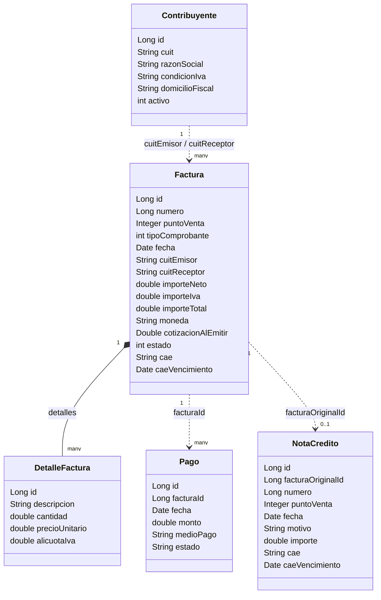

# Arquita Legacy - Monolito de Facturación (proyecto base del curso)

Este proyecto consiste en un monolito de facturación electrónica con temática del organismo
fiscal **Arquita**, construido con Java 7, servlets planos (Servlet API 2.5) y Hibernate
configurado a mano con XML (sin Spring, sin anotaciones de persistencia).

## Dominio

El sistema emite comprobantes (facturas y notas de crédito) entre
contribuyentes, y registra los pagos que se hacen contra esas facturas.

- **Contribuyente**: una persona o empresa identificada por su CUIT, con
  una condición frente al IVA (`RESPONSABLE_INSCRIPTO`, `MONOTRIBUTO`,
  `CONSUMIDOR_FINAL`, ...). Puede actuar como emisor o como receptor de
  una factura.
- **Factura**: un comprobante (tipo A, B o C) emitido por un contribuyente
  a otro, compuesto por una o más líneas (`DetalleFactura`). Tiene un
  importe neto, el IVA calculado, un total, y queda "autorizada" con un
  CAE y su fecha de vencimiento. Puede estar en distintos estados
  (borrador, emitida, pagada, anulada).
- **DetalleFactura**: cada línea de una factura — una descripción,
  cantidad, precio unitario y alícuota de IVA.
- **Pago**: un pago registrado contra una factura. Una factura puede
  recibir más de un pago hasta cubrir su importe total.
- **NotaCredito**: el comprobante que se emite cuando hay que anular una
  factura que ya fue pagada (en vez de anularla directamente).


```mermaid
classDiagram
    class Contribuyente {
        Long id
        String cuit
        String razonSocial
        String condicionIva
        String domicilioFiscal
        int activo
    }

    class Factura {
        Long id
        Long numero
        Integer puntoVenta
        int tipoComprobante
        Date fecha
        String cuitEmisor
        String cuitReceptor
        double importeNeto
        double importeIva
        double importeTotal
        String moneda
        Double cotizacionAlEmitir
        int estado
        String cae
        Date caeVencimiento
    }

    class DetalleFactura {
        Long id
        String descripcion
        double cantidad
        double precioUnitario
        double alicuotaIva
    }

    class Pago {
        Long id
        Long facturaId
        Date fecha
        double monto
        String medioPago
        String estado
    }

    class NotaCredito {
        Long id
        Long facturaOriginalId
        Long numero
        Integer puntoVenta
        Date fecha
        String motivo
        double importe
        String cae
        Date caeVencimiento
    }

    Factura "1" *-- "many" DetalleFactura : detalles
    Contribuyente "1" ..> "many" Factura : cuitEmisor / cuitReceptor
    Factura "1" ..> "many" Pago : facturaId
    Factura "1" ..> "0..1" NotaCredito : facturaOriginalId
```

Las flechas punteadas (`..>`) marcan relaciones que **no** son claves
foráneas ni asociaciones reales en el mapeo de Hibernate: hoy son simples
campos `String`/`Long` sueltos (`cuitEmisor`, `cuitReceptor`, `facturaId`,
`facturaOriginalId`) que cada parte del código interpreta por su cuenta.

### Reglas de negocio (comportamiento actual)

- El CUIT de emisor y receptor se valida con dígito verificador; si no es
  válido, se rechaza la operación.
- Solo un contribuyente `RESPONSABLE_INSCRIPTO` puede emitir una Factura A.
- La alícuota de IVA es 21% en general, 0% si el emisor es `MONOTRIBUTO`.
- Si el total de una factura supera $1.000.000, el receptor tiene que estar
  previamente dado de alta (no se crea automáticamente en ese momento).
- Un pago en efectivo mayor a $500.000 se rechaza (requeriría autorización
  adicional, no implementada).
- Un pago no puede superar el saldo pendiente de la factura.
- No se puede registrar un pago sobre una factura en estado `BORRADOR` o
  `ANULADA`.
- Cuando la suma de los pagos de una factura cubre su importe total, la
  factura pasa a estado `PAGADA` automáticamente, sin requerir un paso
  adicional.
- Anular una factura que ya estaba `PAGADA` emite automáticamente una nota
  de crédito por el importe total; anular una factura en cualquier otro
  estado no tiene validaciones adicionales.
- También se puede emitir una nota de crédito para una factura existente en
  cualquier momento, en cualquier estado, sin que eso la anule (endpoint
  separado, ver más abajo).
- Cada factura y cada nota de crédito quedan "autorizadas" con un CAE y una
  fecha de vencimiento (10 días desde la emisión).

## Instalación y puesta en marcha

Requisitos previos: [Docker Desktop](https://www.docker.com/products/docker-desktop/)
instalado y en ejecución, y un JDK 7 u 8 (ver el paso 1).

### 1. JDK 7 u 8

El proyecto compila con `maven.compiler.source/target = 1.7`. Si en el
equipo ya hay instalado un JDK más reciente (17, 21...), es necesario
instalar además un JDK 8 — no reemplaza al que ya está instalado, ambos
pueden convivir.

**Instalación en Windows** (PowerShell, mediante `winget`, incluido en
Windows 10/11):

```powershell
winget install --id EclipseAdoptium.Temurin.8.JDK --silent --accept-package-agreements --accept-source-agreements
```

Esto instala Eclipse Temurin JDK 8 en
`C:\Program Files\Eclipse Adoptium\jdk-8.0.x.x-hotspot` (la versión exacta
puede variar). En Mac/Linux, se recomienda utilizar `sdkman`
(`sdk install java 8.0.462-tem`) o `jenv`.

### 2. Base de datos: Oracle mediante Docker

```powershell
docker compose up -d
docker compose logs -f oracle-db   # esperar "DATABASE IS READY TO USE!"
```

El primer inicio demora entre 1 y 2 minutos: se crea la base de datos, el
usuario de la aplicación (`arquita_app` / `arquita_app_2013`, ver `pom.xml`)
y se ejecutan los scripts de `db/init/`. Los datos se conservan en un volumen
de Docker (`arquita-oracle-data`), por lo que persisten luego de un
`docker compose down`; para reiniciar desde cero: `docker compose down -v`.

### 3. Compilación y ejecución

**Desde la terminal**, con la variable `JAVA_HOME` apuntando al JDK 8 (el
cambio afecta únicamente a la sesión actual de PowerShell, no modifica la
configuración del sistema):

```powershell
$env:JAVA_HOME = "C:\Program Files\Eclipse Adoptium\jdk-8.0.504.1-hotspot"
$env:Path = "$env:JAVA_HOME\bin;" + $env:Path
mvn -v   # confirmar que dice "Java version: 1.8...."
mvn tomcat7:run
```

**Desde IntelliJ IDEA**:

1. **Agregar el JDK 8 a IntelliJ** (si aún no está registrado): en
   `File | Project Structure | Platform Settings | SDKs | +` debe indicarse
   la carpeta donde se instaló el JDK 8.
2. **Asignarlo al proyecto**: en `File | Project Structure | Project | SDK`
   debe seleccionarse el JDK 8. En `Language Level` debe dejarse `8` (o `7`
   si el IDE lo ofrece); nunca `17` ni `21`.
3. **Asignarlo también a Maven** (de lo contrario, IntelliJ utiliza el JDK
   con el que se ejecuta el propio IDE para invocar `javac`, generalmente
   uno más moderno): en `Settings | Build, Execution, Deployment |
   Build Tools | Maven | Importing`, campo `JDK for importer`, debe
   seleccionarse el JDK 8. Debe repetirse el mismo paso en
   `Settings | Build Tools | Maven | Runner`, campo `JRE`.
4. **Iniciar el proyecto**: abrir el panel Maven (`View | Tool Windows |
   Maven`), expandir `legacy-monolith-facturacion | Plugins | tomcat7`, y
   ejecutar `tomcat7:run` con doble clic (o crear una Run Configuration de
   tipo Maven con el goal `tomcat7:run`).

### 4. Verificación del inicio

`http://localhost:8080/arquita-legacy`. La sección siguiente detalla las
URLs disponibles de la API.

## Uso de la API

Acceder a `http://localhost:8080/arquita-legacy` sin ninguna ruta adicional
devuelve **404**: es el comportamiento esperado, dado que no hay nada mapeado
a la raíz — cada recurso es un servlet plano declarado a mano en `web.xml`,
mapeado a `/api/contribuyentes/*`, `/api/facturas/*` o `/api/pagos/*`. Toda
la API se expone bajo `/api`.

| Método | Endpoint | Qué hace |
|---|---|---|
| POST | `/contribuyentes/alta` | Da de alta un contribuyente |
| GET | `/contribuyentes/buscar?cuit=...` | Busca un contribuyente por CUIT |
| POST | `/facturas/crear` | Crea y emite una factura (con CAE) |
| GET | `/facturas/por-receptor?cuit=...` | Lista las facturas recibidas por un CUIT |
| POST | `/facturas/anular` | Anula una factura |
| POST | `/facturas/nota-credito` | Emite una nota de crédito para una factura existente |
| POST | `/pagos/registrar` | Registra un pago contra una factura |

Al iniciar la aplicación se cargan automáticamente 4 contribuyentes de
prueba con CUIT válido (ver `DataSeeder`). Los siguientes dos endpoints son
GET y pueden probarse ingresando la URL directamente en el navegador:

- `http://localhost:8080/arquita-legacy/api/contribuyentes/buscar?cuit=20-12345678-6`
- `http://localhost:8080/arquita-legacy/api/facturas/por-receptor?cuit=20-12345678-6`

El resto de los endpoints son POST; para probarlos se requiere `curl` (o una
herramienta equivalente, como Postman o Insomnia):

```bash
# Crear una factura en pesos
curl -X POST "http://localhost:8080/arquita-legacy/api/facturas/crear" \
  --data-urlencode "cuitEmisor=30-71659554-0" \
  --data-urlencode "cuitReceptor=20-12345678-6" \
  --data-urlencode "tipoComprobante=6" \
  --data-urlencode "descripcionItem=Servicio de consultoria" \
  --data-urlencode "cantidad=1" \
  --data-urlencode "precioUnitario=10000"

# Crear una factura en USD
curl -X POST "http://localhost:8080/arquita-legacy/api/facturas/crear" \
  --data-urlencode "cuitEmisor=30-71659554-0" \
  --data-urlencode "cuitReceptor=27-98765432-0" \
  --data-urlencode "tipoComprobante=1" \
  --data-urlencode "descripcionItem=Licencia de software" \
  --data-urlencode "cantidad=1" \
  --data-urlencode "precioUnitario=100" \
  --data-urlencode "moneda=USD"

# Registrar un pago (usar el "id" que devolvio la creacion de la factura)
curl -X POST "http://localhost:8080/arquita-legacy/api/pagos/registrar" \
  --data-urlencode "facturaId=<id>" \
  --data-urlencode "monto=12100" \
  --data-urlencode "medioPago=TRANSFERENCIA"

# Anular una factura ya pagada (dispara la emision de una nota de credito)
curl -X POST "http://localhost:8080/arquita-legacy/api/facturas/anular" \
  --data-urlencode "facturaId=<id>"

# Emitir una nota de credito para una factura, sin anularla
curl -X POST "http://localhost:8080/arquita-legacy/api/facturas/nota-credito" \
  --data-urlencode "facturaId=<id>" \
  --data-urlencode "motivo=Descuento comercial acordado"

# Dar de alta un contribuyente nuevo
curl -X POST "http://localhost:8080/arquita-legacy/api/contribuyentes/alta" \
  --data-urlencode "cuit=23-11111111-1" \
  --data-urlencode "razonSocial=Cliente Nuevo SA" \
  --data-urlencode "condicionIva=RESPONSABLE_INSCRIPTO"

# Buscar un contribuyente de prueba
curl "http://localhost:8080/arquita-legacy/api/contribuyentes/buscar?cuit=20-12345678-6"
```

## Stack tecnológico (estado actual)

- Java 7, compilado explícitamente con `source`/`target` 1.7 (requiere un
  JDK 7 u 8 instalado, ver arriba).
- **Sin Spring, sin contenedor de inyección de dependencias.** La API web
  son servlets planos (`javax.servlet.http.HttpServlet`) declarados a mano
  en `web.xml` (Servlet 2.5), sin `@WebServlet` ni `DispatcherServlet`; se
  empaqueta como WAR. No hay capas de controller/service/dao separadas:
  cada servlet concentra validaciones, consultas y armado de la respuesta.
- Hibernate 4.2 con **mapeo clásico por XML** (`*.hbm.xml`, ver
  `src/main/resources/mapeo/`): las entidades de `dominio/` son POJOs sin
  ninguna anotación de persistencia. La `EntityManagerFactory` se arma a
  mano (`com.arquita.legacy.persistencia.HibernateUtil`,
  `Persistence.createEntityManagerFactory(...)`) vía
  `src/main/resources/META-INF/persistence.xml`, sin pool externo (usa el
  `DriverManagerConnectionProvider` interno de Hibernate).
- Oracle XE real, levantado con Docker Compose (ver arriba).
- Log4j 1.x.
- Generación del CAE delegada a una librería externa
  (`com.arquita:arquita-cae-client`, vendorizada en `libs/`), a través de
  `AutorizadorFiscalClient`.

## Estructura del código

```
src/main/java/com/arquita/legacy/
  dominio/       entidades (POJOs, mapeadas por XML en resources/mapeo/)
  persistencia/  HibernateUtil (EntityManagerFactory a mano) y el singleton
                 de conexion JDBC usado para llamar a los procedures PL/SQL
  web/           servlets planos: ContribuyenteServlet, FacturaServlet, PagoServlet
  util/          ArquitaUtils, Constantes, NotificacionEmailHelper
  arranque/      ArranqueListener (ServletContextListener) + seed de datos de demo

src/main/resources/
  META-INF/persistence.xml   unidad de persistencia JPA (RESOURCE_LOCAL)
  mapeo/*.hbm.xml            mapeo entidad <-> tabla, uno por entidad

libs/          .jar vendorizado (arquita-cae-client) con estructura de repositorio Maven,
                 referenciado directo desde pom.xml (no requiere compilacion adicional)

db/init/       scripts que se ejecutan al crear el contenedor de Oracle (esquema y objetos PL/SQL)
```